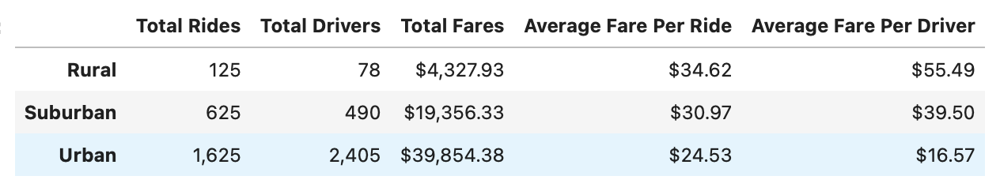
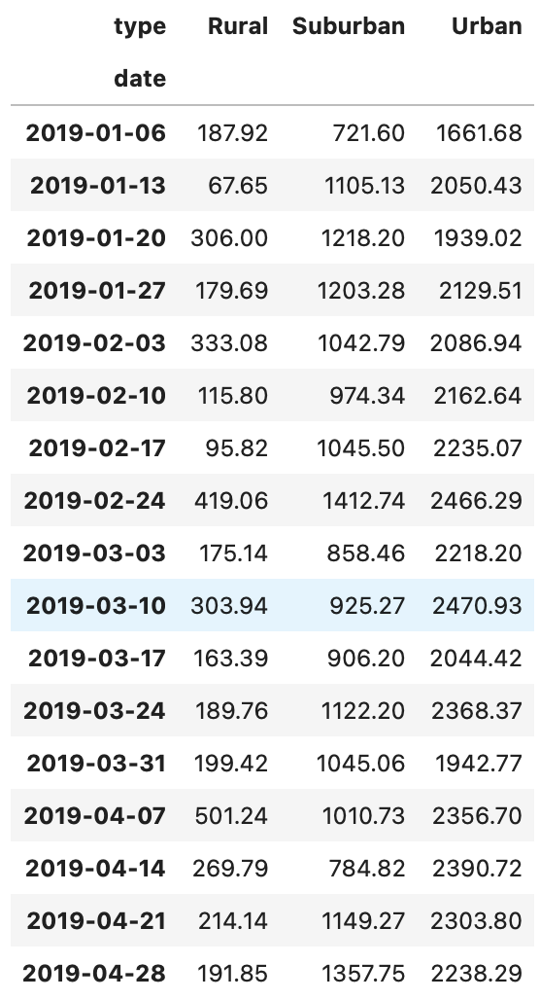
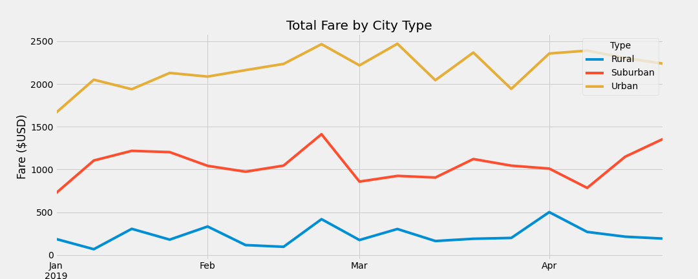

# PyBer_Analysis

## Overview of the project
To use the data to calculate the weekly fare over time by city type, and create clear, easy to understand visulization for stakeholders.

## Results

The result summarize the total rides, total drivers, total fares, and average of fare per ride and fare per driver for each city type.

##### Rural
- Total rides : 125
- Total drivers : 78
- Total fares : $4,327.93
- Average fare per ride : $34.62
- Average fare per driver : $55.49

##### Suburban
- Total rides : 625
- Total drivers : 490
- Total fares : $19,365.33
- Average fare per ride : $30.97
- Average fare per driver : $39.50

##### Urban
- Total rides : 1,625
- Total drivers : 2,405
- Total fares : $39,845.38
- Average fare per ride : $24.53
- Average fare per driver : $16.57

#### Weekly fares reports

From the results we can see that in rural cities, the total rides/driver and total fares are the lowest, but has the highest average fare per ride/driver. Urban cities have the highest total ride/drivers and total fares, but have the lowest average fare per ride/driver, and suburban cities has the number in between the two other type of cities.

## Summary
In the urban cities we see significantly higher numbers of total rides/drivers and total fares, the total fare has about 80% of the total drivers and generate about 60% of the total fares, more than half of the revenue comes from the urban cities, but the driver number is also very high, which means competition is high, therefroe, it has the lowest average fare per ride/driver. So, for the urban cities, possible business strategies can be provide **peak hour rates**, and in urban cities the distance of each ride could be shorter, so **rates by distance** could be a good srtatgies as well (such as first 5 miles has higher rate, 6-15 miles will be lower).

